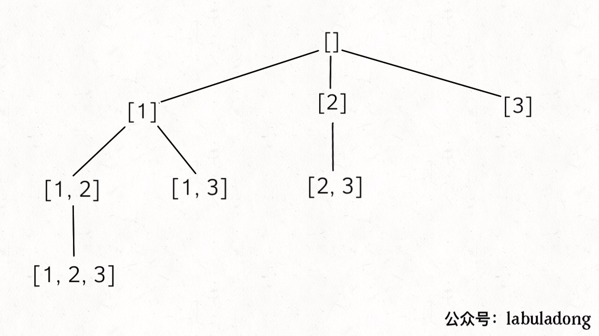

#### 1. Backtracking Template

```python
result = []
def backtrack(Path, Seletion List):
    if meet the End Conditon:
        result.add(Path)
        return

    for seletion in Seletion List:
        select
        backtrack(Path, Seletion List)
        deselect
```

#### 2. Backtracking Example

```python
def subsets(nums):
    res = []
    def backtrack(start, path):
        res.append(path)
        for i in range(start, len(nums)):
            backtrack(i+1, path+[nums[i]])
    backtrack(0, [])
    return res
```


